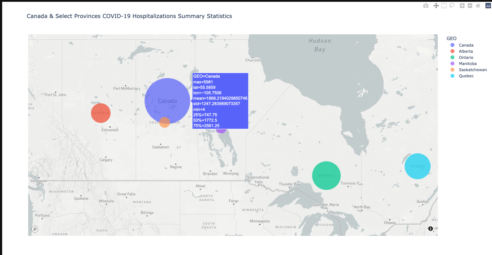
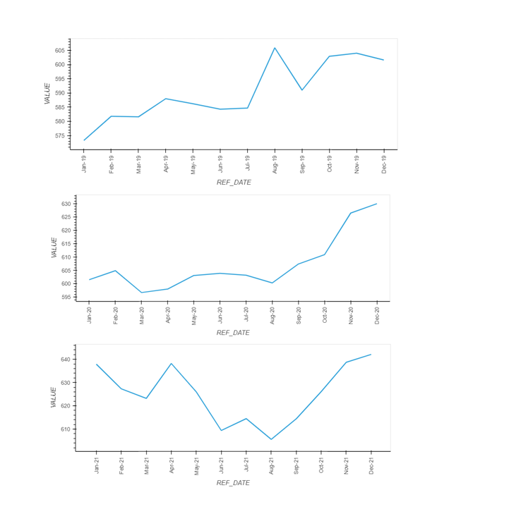
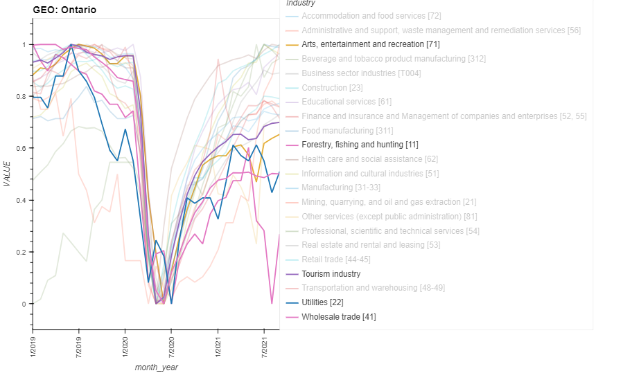
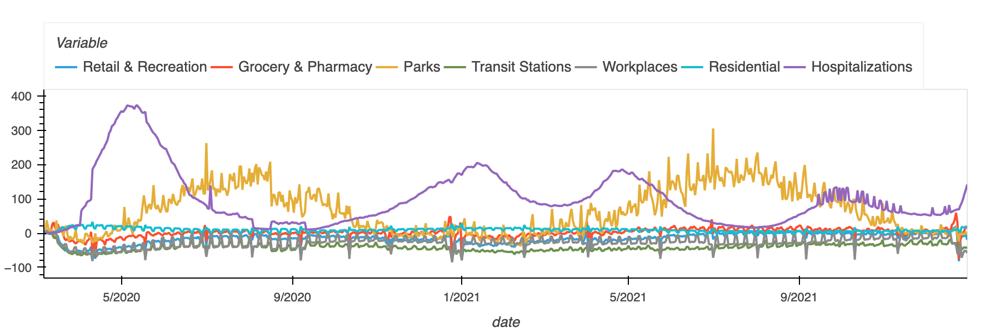
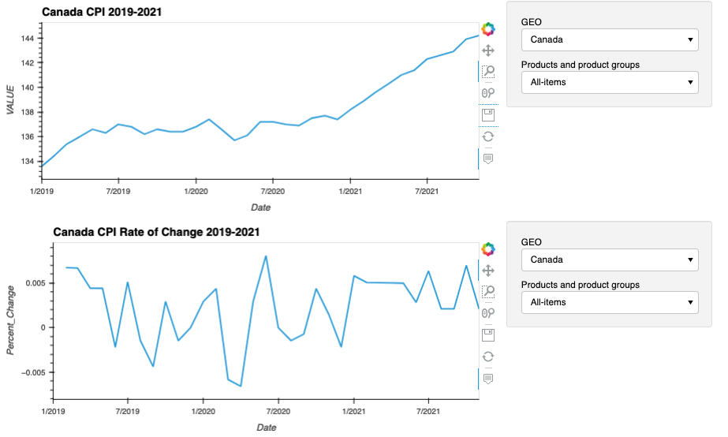

# Impact Analysis of COVID-19 in Canada

###### Contributors: Tyeson Demets (tyedem), Nimai Desai (Nimai95), Trevor Yeomans (YuPsx2), Satheesh Mohan (Satheeshbm)

 
 #
  Project Outline: Measuring COVID-19's impact on Canadian job markets, consumer price index, industries and businesses, and community mobility

## Research Questions: 
#
1) How many COVID-19 hospitalizations have occurred in Canada through the pandemic?
2) What sectors in the job market are affected?
3) What were the top 5 industries impacted? 
4) How many businesses shut down across various industries?
5) What is COVID-19's impact on community mobility in Canada?
6) What is COVID-19's impact on the Canadian CPI?
#
Datasets:
[Statcan](https://www.statcan.gc.ca/en/start), [Kaggle](https://www.kaggle.com/), [Bank of Canada](https://www.bankofcanada.ca/), [FRED](https://fred.stlouisfed.org/), [data.gov](https://www.data.gov/), [Our Wolrd in Data](https://ourworldindata.org/), [Google Community Mobility Reports](https://www.google.com/covid19/mobility/), [mapbox](https://www.mapbox.com/) and individual Canadian province open data websites. See data sources below.
#
Breakdown of responsibilities:

1) COVID-19 hospitalizations and CPI: Tyeson
2) Job market: Nimai
3) Top 5 industries and businesses: Trevor 
4) Community mobility: Satheesh
#
# Hypothesis
It is expected that the data will show as there is a rise in hospitalizations in Canada, there will be an obvious impact in the Canadian job market, industries and businesses, community mobility trends and the CPI.

# Summary Findings
#
## COVID-19 Hospitalizations
#
Canada COVID-19 Summary Stats Map
### Data Exploration & Cleanup

Data exploration involved navigating through Canadian provincial government open data web portals and perusing their data catalogue to find relevant data surrounding COVID-19. It was decided that the total # of COVID-19 hospitalzations is the better data to analyze over total cases given the variability baked into how cases were tracked. For example, the quality of tracking cases is heavily subject to provincial COVID-19 testing capacity and the fact that severity of symptoms varied widely between individuals and certain demographics. Whereas the total # of COVID-19 hospitalizations limits the variability of the severity of symptoms to those who require inpatient medical treatment and are thus incapable of working, which has a direct and obvious impact on the Canadian economy.

It was expected that COVID-19 open data would be available for all Canadian provinces and territories. However, data was only publicly available for the provinces of Quebec, Ontario, Manitoba, Saskatchewan and Alberta. Canada-wide hospitalizations data was not available through [Statcan](https://www.statcan.gc.ca/en/start) and had to be sourced via [Our World in Data](www.ourworldindata.org). After drilling down into their dataset, we were unable to locate a daily tracking of provincial hospitalizations and thus our hospitalizations dataset is restricted to the Canada-wide and the aforementioned provinces we were able to pull from the open data portals.

### Data Assumptions
Since each province has their own regulatory health authority, the methods of tracking COVID-19 are not consistent across provinces. For example, Ontario makes very specific distinctions between Intensive Care Units (ICUs) tracked, i.e. ICU due to COVID-19 related illness, ICU testing positive for COVID-19, ICU no longer testing positive for COVID-19, ICU on ventilators due to COVID-19, ICU on ventilators due to COVID-related critical illness, etc. No other province makes such specific distinctions in ICU tracking. Methods of tracking are also publicized with varying levels of detail, except Saskatchewan which doesn't publicize any details except that their dataset captures hospitalizations and ICUs. All hospitalization data is reported by hospitals to regional health authorities who then report to the provincial health authority. Canada's provincially regulated health system makes for data collection subject to greater variability than would be in a centralized regulatory health system. It has been decided to consolidate all hospitalizations and ICU data into a single dataset to limit this variability.

### Analysis - How many COVID-19 hospitalizations have occurred in Canada through the pandemic?
Canada_CPI_energy.png
The number of hospitalizations reflects the direct impact to the Canadian economy as a clear measure of workers who are unable to report to work. Of the hospitalizations datasets available, hospitalization movements generally follow a similar pattern at similar times, though Saskatchewan and Manitoba have experienced a very mild impact relative to the rest of the provinces measured. It is evident from the data Canada as a nation experienced 4 waves during the pandemic and at time of writing (January 2022), Canada is in the beginning of its 5th and largest wave yet. It remains unclear how acute this spike in hospitalizations will be over time. 

Ontario, Quebec and Alberta have each experienced major impacts due to COVID-19. Ontario and Quebec's impact are similar in the 1st wave April 2020 (when health authorities began tracking COVID-19 hospitalizations) and have generally followed the same pattern. One notable exception is Ontario's 3rd wave between March and June 2021 with its greatest peak. No other province measured experience such a dramatic spike in hospitalizations. Alberta experienced a later wave between September 2021 - December 2021. January 2021 is proving to be Quebec's largest spike in hospitalizations since the pandemic began in 2020. 

### Post-Mortem
Given more time I would have liked to work more collaboratively with my analyst partners to identify other trends, correlations and findings. We would have liked to have done some comparative analysis with other international regions to understand the variation of COVID-19s impact on other economies. Some challenges faced during this project included debugging a mapbox animation to capture the number of hospitalizations per region over time into Panel. This animation would prove to be a powerful visualization to demonstrate COVID-19s impact through time.
#
## Job Market
#
Samples Job Markets Data 2019-2021
### Data Exploration & Cleanup
One aspect of our project to analyse the COVID-19 impact on the job market and its sectors. The research started with finding the different sectors of the job industry which were impact by covid-19 and the timeframe by which we can analyse. The analyzation is a comparative analysis between 2019-2021 for the different job industries in different provinces of the Canada. The data was got from statscan which showed the labour force from 2019-2021. The challenge started to cleanup data from statscan database for the labour force and only showing data that would represent the comparative analysis of the labour force. Some steps taken to analyse the data was splitting the years, the choices were using a code which pick the year needed and then take further steps, using line graphs which can help in doing a deeper analysing of the data.

### Analysis - What sectors in the job market are affected?
To discuss the findings, out of the 10 provinces if we look at just Ontario, Quebec and Alberta, in the most common job fields of the country like finance, wholesale and retail, and healthcare within these provinces. To start with the finance or corporate job sector, we see in 2019  in Ontario is like a mountain where people are getting jobs this field and some of them are not, but as we go to 2020 we see during Feb 2020, which is the time when the pandemic started, the fall of jobs was significant and it kept going until Aug 2020, and in 2021 it started to 
recover in March, because of the latest variant it started to fall. For Quebec and Alberta it has been much of a different except the job market started to fall in April 2020 instead of Mar and it has started to go up. Lastly for Alberta, it too was similar, but comparing to Quebec its more of a mountain structure. In the wholesale and retail sector, just in Ontario it has been like a mountain but for remaining of the provinces its worked out well in terms of recovery. And lastly for healthcare, for all the years, people have started to join and leave, as the pandemic have made all theworkers, from doctors to nurses assistance, interns etc. have left their work, or trying to help

### Post-Mortem
It did meet expectation, because of the current news going 
around, staff shortages, unions demanding more money, have created shortage of jobs in these industries. Some solutions that can be used to find some incentives or programs which can help fill the shortage of these industries which in turn can boost the economy and lower the unemployment rate. Some difficulties were finding the 
correct data, from statscan job market data was gigantic and also whether it was a monthly data, or yearly information. Some questions arorse where, whether or not these labour force, quit their jobs or their employers laid them off. If we could do some more detailed research, it could also be to a point where we can use data 
from USA and compare it to Canada.
#
## Industries & Businesses
#
Sample Ontario Industries Impact Chart 2019-2021

## Businesses - What were the top 5 industries impacted

The business dataset was nicely organized in the Stats Canada website; 
cleanup included dropping extra columns, setting the index, and scaling 
the columns so that relative performance could be used. Exploration was 
then performed using the groupby function to review the data by toggling 
industry and province.

### Data Exploration & Cleanup
Across the provinces and the territories there are industries that are 
very few in number. The categorization of the industries by Stats Canada 
also seems a bit imprecise. Industry labelling errors in the small 
industries in the small provinces can impact the interpretation. For our 
purposes we did not review the data for this sort of impact.

### Data Assumptions
Across the provinces and the territories there are industries that are 
very few in number. The categorization of the industries by Stats Canada 
also seems a bit imprecise. Industry labelling errors in the small 
industries in the small provinces can impact the interpretation. For our 
purposes we did not review the data for this sort of impact

### Analysis - How many businesses shut down across various industries?

Ontario's most affected industries were:
 1. Forestry, fishing, hunting
 2. Utilities
 3. Wholesale trade
 4. Arts, entertainment
 5. Tourism

### Post-Mortem
Since it was so easy to pull the data from across data, there was too 
much too analyse - the whole list of NAICS sectors for each province and 
territory. It was also difficult to tell whether the industries were 
closed because of the health restrictions or because of the economic 
effects.

## Community Mobility
#
Community Mobility 2020 - 2021
### Data Exploration & Cleanup
The mobility data was available from Google and Apple for most countries. The mobility dataset required for the scope of the project was of Canada. Apple data was not considered for the scope of this project since the dataset metric was related mode of mobility like 
walking, cycling etc. Google dataset contained datapoints show movement trends by region, across different categories of places. The datapoint shows how visitors to (or time spent in) categorized places change compared to the baseline days mobility for the report date to the
baseline day. The baseline data being the median value for a 5 week period from Jan 3 to Feb 6 2020. Since this data was being analysed alongside the hospitalisation data, we had to sync the datapoint for the available provinces and the available datapoints, across dates and remove null dates.

### Data Assumptions
These datasets show how visits and length of stay at different places change compared to a baseline. What data is included in the calculation depends on user settings, connectivity, and whether it meets Google's privacy threshold. When not met, such datapoints were removed - which could have skewed the data. Also ,Google has disclosed that this is only a sample of such eligible datapoints.

### Analysis - What is COVID-19's impact on community mobility in Canada?
It was interesting to note that mobility towards parks had a correlation to hospitalizations as opposed to other locations, inc transit stations. All other movements had no relative trend towards hospitalizations.

### Post-Mortem
It would further help to extrapolate the data, run a MC simulation to check on the hospitalization trends to mobility in the coming days to see the movement trends in the coming days exp since we are in the next biggest wave, as on date of this report. Also it would be interesting to work on a comparison across USA and Canada & study how community mobility was in between the two countries during the pandemic.
#
## Consumer Price Index
#
Canada Consumer Price Index 2019-2021
### Data Exploration & Cleanup
We were able to pull CPI data directly from [Statcan](https://www.statcan.gc.ca/en/start). There were a few options available, so it was decided that the monthly CPI report was selected without seasonal adjustment to best reflect the true costs of goods and services without any statistical smoothening.

### Data Assumptions
There are a number of assumptions embedded into the development of the CPI of which only a few significant assumptions are highlighted here. The dataset used is not seasonally adjusted to even out seasonal swings in price movements. The quality of the data is constrained by budgets and the information available during the sampling process. The official time base in this CPI is 2002=100. The change is strictly an arithmetic conversion, but leaves the percentage changes between any two periods intact, except for any differences from rounding. For more details on CPI sampling, imputation, quality control, etc., visit https://www23.statcan.gc.ca/imdb/p2SV.pl?Function=getSurvey&SDDS=2301.

### Analysis - What is COVID-19's impact on the Canadian CPI?
Overall, price movements in Canada has seen steady growth trend and a particular steep climb upwards since December 2020. January 2019 saw an overall value of 133.6 and November 2021 saw an overall value of 144.2. A 7.9% increase over this time period. All provinces follow the same trend in price movements.

Some product groups of interest in Canada include Clothing and Footwear and Fresh Fruit and Vegetables which has seen major volatility. Energy experienced a particularly steep drop between February 2020 and April 2020. While Services was the only group that did not experience any drop when the pandemic hit in March 2020.

Focusing on the rate of change, Canada has seen overall volatility. Each province experienced some volatility to varying degrees. The territories experienced the greatest amount of volatility compared to the provinces.

### Post-Mortem
No particular difficulties arose for the CPI data. Given more time we would have done some more correlation analysis with the CPI.

# Data Sources
## COVID-19 Hospitalization Data

1.	Canada - https://ourworldindata.org/grapher/current-covid-patients-hospital?country=~CAN
2.	Alberta - https://www.alberta.ca/stats/covid-19-alberta-statistics.htm#data-export
3.	Ontario - https://data.ontario.ca/en/dataset/covid-19-cases-in-hospital-and-icu-by-ontario-health-region

4. Quebec - https://www.donneesquebec.ca/recherche/dataset/covid-19-portrait-quotidien-des-hospitalisations

5.	Manitoba - https://geoportal.gov.mb.ca/datasets/manitoba::manitoba-covid-19-daily-cases-and-hospitalizations-historical/about
6.	Saskatchewan - https://dashboard.saskatchewan.ca/health-wellness/covid-19-cases/hospitalized

7. Geospatial Data - https://docs.mapbox.com/help/demos/geocoding/final.html

## Job Market

https://www150.statcan.gc.ca/t1/tbl1/en/cv!recreate.action?pid=1410002201&selectedNodeIds=2D2,3D1&checkedLevels=0D2,2D2,2D3,2D4,3D1,4D1&refPeriods=20210101,20211201&dimensionLayouts=layout3,layout3,layout3,layout3,layout3,layout2&vectorDisplay=true

## Industries
https://www150.statcan.gc.ca/t1/tbl1/en/cv.action?pid=3310027001

## Community Mobility

https://www.google.com/covid19/mobility/

## Consumer Price Index
https://www150.statcan.gc.ca/t1/tbl1/en/tv.action?pid=1810000401